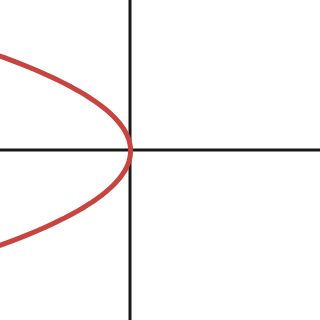
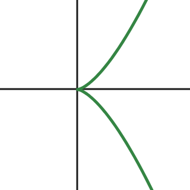
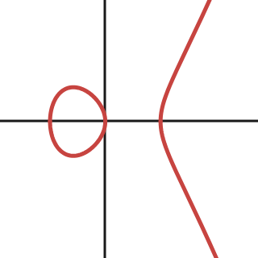
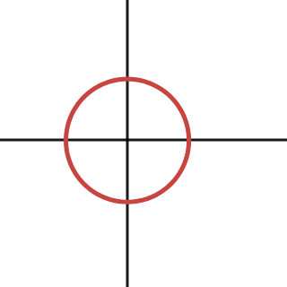

The following three are examples of algebraic curves - curves that are cut out by polynomial equations.

$$x+y^2=0$$
<a id="nodes">.png)</a>
$$y^2=x^2(x+1)$$

$$y^2=x^3$$

Now consider this following curve,

which is defined by the equation $$y^2=x^3-x,$$ which can be rewritten as $$y^2-x^3+x=0.$$

Algebraic geometry begins as the study of zeros of algebraic equations like the ones above. At the same time, it has a reputation of being incredibly abstract. This is because algebraic geometry is not just about the zeros of algebraic equations - it is really about the bridge between algebra and geometry. An example best illustrates this: consider the unit circle,

$$x^2+y^2=1$$
and consider a function $f$ that maps a point $(x,y)$ on the unit circle to its $y$-coordinate,
$$f(x,y)=y$$
=y.png)
$$\left(\frac{1}{\sqrt{2}},\frac{1}{\sqrt{2}}\right)\overset{f}{\mapsto}\frac{1}{\sqrt{2}},\quad \left(\frac{1}{\sqrt{2}},\frac{-1}{\sqrt{2}}\right)\overset{f}{\mapsto}\frac{-1}{\sqrt{2}}.$$

In order to understand an object, it often makes sense to study functions on that object. A more interesting function could be
$$h(x,y)=x+2y$$
=x+2y.png)
$$\left(\frac{1}{\sqrt{2}},\frac{1}{\sqrt{2}}\right)\overset{h}{\mapsto}\frac{3}{\sqrt{2}},\quad \left(\frac{1}{\sqrt{2}},\frac{-1}{\sqrt{2}}\right)\overset{h}{\mapsto}\frac{-1}{\sqrt{2}}.$$

Consider the function $$g(x,y)=x+2y+x^2+y^2-1.$$ The part $x^2+y^2-1$ always evaluates to $0$ for points $(x,y)$ on the unit circle, so $g$ and $h$ are the *same* as functions on the unit circle. So $g\left(\frac{1}{\sqrt{2}},\frac{1}{\sqrt{2}}\right)=\frac{3}{\sqrt{2}}=h\left(\frac{1}{\sqrt{2}},\frac{1}{\sqrt{2}}\right)$ and similarly $g\left(\frac{1}{\sqrt{2}},\frac{-1}{\sqrt{2}}\right)=\frac{-1}{\sqrt{2}}=h\left(\frac{1}{\sqrt{2}},\frac{-1}{\sqrt{2}}\right).$ The function $$\phi(x,y)=x+2y+y(x^2+y^2-1)$$ is also the same as $g$ and $h$ on the unit circle. More generally, any function of the form $$\psi(x,y)=x+2y+\varphi(x,y)(x^2+y^2-1)$$ will be the same as $h(x,y)=x+2y$ on the unit circle.

The set of polynomials in $x$ and $y$ with real coefficients is denote $\mathbb{R}[x,y].$ This is more than just a set, it is

- closed under addition
- closed under multiplication

and an algebraic object that behaves in this way is called a *ring*. Now, let $$\mathcal{R}=\{\text{polynomial functions defined on the unit circle}\}.$$ We think of two polynomials as defining the same function if they agree at all points $(x,y)$ on the unit circle - then they are equal as members of $\mathcal{R}.$ So $h$ and $\psi$ are equal as members of $\mathcal{R}.$ We can add and multiply functions in $\mathcal{R},$ so it is also a ring.

## Coordinate ring

We say that $\mathcal{R}$ is the **coordinate ring** of the circle. We view it as the algebraic manifestation of the circle. As we will see, geometric properties of this circle are encoded in the algebraic properties of its coordinate ring. In fact, what we are doing here is working with the *quotient ring* $$\mathcal{R}=\mathbb{R}[x,y]/(x^2+y^2-1).$$

## How algebra detects reducibility

Now consider the curve $(y-x)(y+x)=0,$

<a id="reducible-curve">(y+x)=0.png)</a>
$$(y-x)(y+x)=0$$

versus [this parabola $x+y^2=0,$](#irreducible-curve) and observe that the first curve is a union of two curves while the second one isn't. We say that [the first curve](#irreducible-curve) is **reducible**, whilst [the second curve](#irreducible-curve) is **irreducible**.

Let $\mathcal R$ be the coordinate ring of $(y-x)(y+x)=0$ and $\mathcal S$ be the coordinate ring of $x+y^2=0.$ The algebra of these two rings, as we will see, is quite different. The first ring $\mathcal R$ is kind of weird, consider the function $f(x,y)=y+x$ in $\mathcal R.$ It is not identically zero, for example $f(1,1)=2\neq 0.$ Similarly the function $g(x,y)=y-x$ is not zero on the curve either, for example $g(1,-1)=-2\neq 0.$ However, their product $$f(x,y)\cdot g(x,y)=(y-x)(y+x)=0$$ is identically zero *everywhere* on the curve (by definition). This type of behaviour may feel strange - the product of two non-zero elements yielding zero. This never happens in the ring $\mathcal S.$ It turns out, and this is not immediately obvious, that for any $f,g\in\mathcal{S}$ $$f(x,y)\cdot g(x,y)=0\implies f(x,y)\equiv0\text{ or }g(x,y)\equiv0.$$ This algebraic phenomenon is detecting that [the first curve](#reducible-curve) has two pieces, that it is *reducible*, whilst [the second curve](#irreducible-curve) has only one piece, it is *irreducible*. The geometry of whether the curve is irreducible or not is appearing in the algebra.

## How algebra detects nodes

The [curve $y^2=x^2(x+1)$](#nodes) intersects itself. It has a *node* at the origin. We want to use algebra to detect this. $$y^2=x^2(x+1)\implies y^2-x^2(x+1)=0\implies (y-x\sqrt{x+1})(y+x\sqrt{x+1})=0.$$

As before, notice that $f(x,y)=y-x\sqrt{x+1}$ and $g(x,y)=y+x\sqrt{x+1}$ are both nonzero on the curve, but their product is identically zero on the curve. If we zoom into the origin, [the curve](#nodes) looks like two lines that are crossing each other - near the origin, the curve "looks reducible."

Now, algebraically, near the origin $\sqrt{x+1}\approx 1.$ So $$f(x,y)\cdot g(x,y)\approx (y-x)(y+x)=0$$ which is precisely the equation of the [two lines crossing each other](#reducible-curve). But there's a problem: $\sqrt{x+1}$ is not a polynomial, so what ring does it live in ? We can write the Taylor series of $\sqrt{x+1}$ as $$\sqrt{x+1} = 1 + \frac{x}{2} - \frac{x^2}{8} + \frac{x^3}{16} - 5\frac{x^4}{128} + \cdots;$$
previously we worked with the polynomial ring $\mathbb{R}[x,y],$ now we work with the *formal power series ring* $\mathbb{R}\llbracket x,y\rrbracket$ which is defined as the set of all formal power series in $x,y$ with real coefficients. We will think of $\sqrt{x+1}\in \mathbb{R}\llbracket x,y\rrbracket,$ or more precisely its Taylor expansion as belonging to this power series ring, $$1 + \frac{x}{2} - \frac{x^2}{8} + \frac{x^3}{16} - 5\frac{x^4}{128} + \cdots\in\mathbb{R}\llbracket x,y\rrbracket.$$

So what we have observed is that there are formal power series which are individually nonzero on the curve, but their product is identically zero on the curve. This detects the fact that, upon zooming into the origin, the curve has two lines that look like they are crossing themselves.

## $\text{Spec}\mathbb{Z}$ and schemes

So far we have translated geometric phenomena into algebraic objects. But what about the reverse ? For example, is there a geometric object that corresponds to $\mathbb{Z}$ ? Can we view $\mathbb{Z}$ as the ring of functions on some geometric object ? There is, in fact, a geometric object called $\text{Spec}\mathbb{Z},$ an example of something called a **scheme**. It is a geometric realisation of the ring $\mathbb{Z}.$

$$\text{Visualisation of Spec}\mathbb{Z}$$
$\text{Spec}\mathbb{Z}$ is drawn as a line, with each point on the line corresponding to a prime number and one point corresponding to $0.$ How do we view integers as functions on this space ? Given an integer $n,$ we evaluate it at each point $p$ of $\text{Spec}\mathbb{Z}$ as $n\pmod{p}$ for every prime $p,$ and at the point $0$ we evaluate $n$ as itself. For example, the integer $10$ evaluates to $0$ at $(2),$ $1$ at $(3),$ $0$ at $(5),$ $3$ at $(7),\dots$ and $10$ at $(0).$ To learn more, read the book *Algebraic Geometry and Arithmetic Curves* by Qing Liu [@QingLiu2006].

# Bibliography
