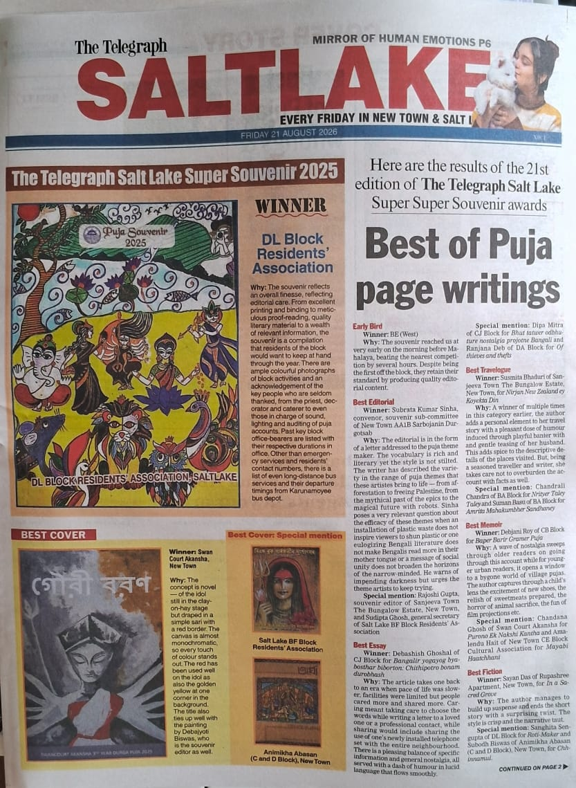
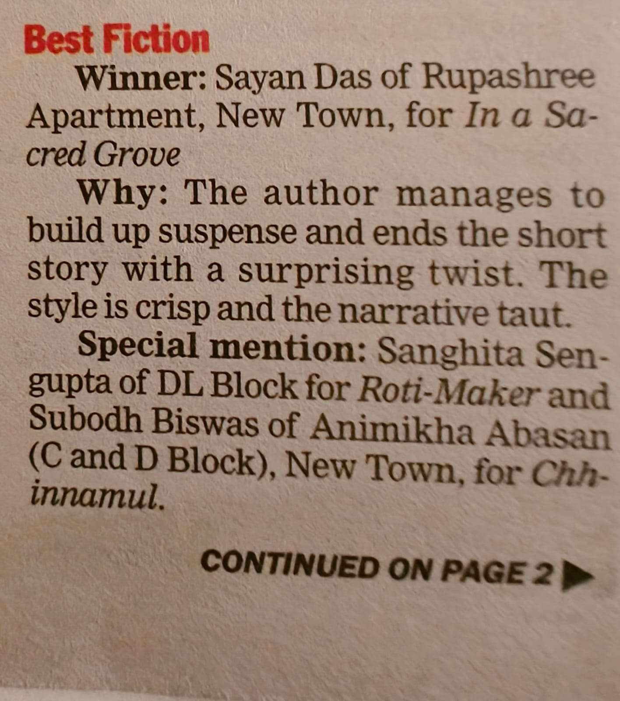

## Preface

One of my short stories won the first prize in the Fiction category, in a [competition among souvenirs](https://web.archive.org/web/20260821125306/https://www.telegraphindia.com/west-bengal/durga-puja-souvenirs-awards-recognise-outstanding-writing-across-seven-categories-prnt/cid/2175941) published by all the Durga Puja committees in the Saltlake & Newtown area, courtesy of [The Telegraph](https://en.wikipedia.org/wiki/The_Telegraph_(India)).

 
 

**If you want zero spoilers, skip this preface and read the story first, in [PDF format](In_A_Sacred_Grove.pdf) if you prefer that.**

My writing was inspired in part by Akutagawa's [_In A Bamboo Grove_](https://en.wikipedia.org/wiki/In_a_Grove) (the title of my story is, in a way, a nod, or homage, to that story) and Kurosawa's movie [Rashōmon](https://en.wikipedia.org/wiki/Rashomon), which is actually based on _In A Bamboo Grove_ rather than _Rashōmon_. It was also partly inspired by the visual novels of Ryukishi07, especially [_Higurashi When They Cry_](https://en.wikipedia.org/wiki/Higurashi_When_They_Cry). In particular, I was really interested in the concept of an unreliable narrator. 

My writing style is also somewhat informed by Hemingway's no-nonsense and to-the-point writing style, while still maintaining some depth beneath the surface of the minimalistic prose. In fact, one may read this story as a journey into the narrator's own subconscious. Indeed, one might ask (as Virupakshaji does, in the story) the narrator 

‘What was a good gentleman like you doing out here at this hour on a deserted hill road ?’ 

And why does it send a chill down the narrator's spine ? 

I do feel that I could have perfected my writing a bit more, but editing for "perfection" is, honestly, a never-ending process.

## The story

Cold, fresh breeze from the snow-capped abodes of the gods greeted me as I opened the window next to my bus-seat. As if I had not been lucky enough to find a bus on an empty stretch of road in the foothills at an ungodly hour, I was also blessed with an empty bus - leaving me free to choose any window seat that I fancied. 

It was somewhat peculiar that there was no conductor — ‘No, sir, I do both the driving and the conducting’, the bus driver told me in his hoarse voice. ‘Just let me know where you want me to drop you off.’ I simply told him to take me to the next stop, and gazed out of the window. 

I could see a dark forest which, although I couldn’t make out the individual trees, was probably full of sal trees. There was no light except for the headlights of the red bus. I was tired, so I didn’t have a good look at the driver’s face, but I found it strange that he was wearing red robes. Like some monk. 

The bus driver was bent double by his age, yet he seemed to love driving fast even around the sharp edges and turns of the serpentine roads. — ‘Don’t worry, sir. I can see everything, I know these roads like the back of my hand.’, was what the driver said to reassure me. 

I closed my window as it was getting too cold and draughty. Tired of looking at the forest, I tried striking a conversation with the driver —

‘What’s your name, good man ?’

‘Virupaksha.’

‘Are you a Buddhist monk ?’

‘You could say so, although I am not associated with any monastery.’

‘Why on earth is a monk driving a bus ?’

‘What was a good gentleman like you doing out here at this hour on a deserted hill road ?’

His words sent a chill down my spine.

‘...Just take me to the next stop.’

‘Of course, sir. Forgive me if I spoke too much.’

We didn’t exchange any words for a long time. A suffocating stillness filled the atmosphere within the bus. I tried dozing off, but I couldn’t. My eyes were sore, but they wouldn’t close. Even if my eyes had managed to close, my mind wouldn’t let me sleep. 

The bus went deeper, and deeper, into the dark hilly woodlands. It bumped and creaked as it snaked along the empty hill road at full speed. The woodlands outside the window were growing thicker and thicker. With a dense concentration of such tall trees, these parts would probably have been dark even in daytime. I wondered what creatures might lurk within such woods. Insects, of course, but also bears, leopards, tigers, snakes. Venomous snakes.

‘Virupakshaji ?’

‘Yes, sir ?’

‘When will we reach the next stop ?’

‘Are you in a hurry, sir ?’

‘In a way…’

‘We have reached the stop.’

The bus screeched to a sudden halt. Disembarking I found that we were in some sort of a clearing, having a grove of banyan trees. I was more accustomed to seeing sal trees around these parts, and the banyan grove seemed out of place. A bed of red hibiscus was growing in the undergrowth. In the centre of the grove there was a large dark boulder shaped like a Shiva linga. 

‘Where is this place ?’ I asked Virupaksha.

‘This is a sacred grove, and the last stop, sir. The road ends here.’

Strangely I wasn’t even able to hear his footsteps. He had kept the headlights on. His face was still in the shadow and I couldn’t see him clearly, but I was able to see that the road did end here indeed, by a steep cliff’s edge. 

‘If you hadn’t braked in time we’d have been down at the bottom by now.’

‘There was, actually, a bus driver who fell down this very cliff on New Years’ Eve. About 18 years earlier. Thankfully the bus had been empty, but the driver couldn’t survive the fall. It is said that he has since turned into a spirit that learnt from his mistakes, and vowed to make sure that he did not repeat his past mistakes. Ever since then, he appears to do his duty on every night of the 31st of December.’

‘Interesting story. Seems like this spirit didn’t turn into a vengeful one.’

‘Are you sure about that, sir ?’

I suddenly realised that a snake had curled itself around my neck, and was now poised to strike me. 
